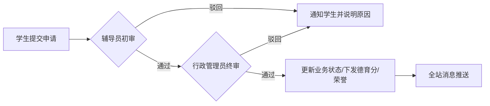

# 🎓 Student-OS: “一站式”学生社区综合服务平台

<p align="center">
  
  
  
  
  
</p>

---

## 🌟 项目简介

**Student-OS** 是一个专为高校设计的“一站式”学生社区综合服务平台。它通过数字化手段集成学生事务管理，打破信息孤岛，实现从**学籍档案、事务申请、德育评分**到**荣誉激励**的全链路闭环管理。

> 🚀 **核心理念**：让学生少跑腿，让数据多走路。

---

## ✨ 核心功能

### 📱 学生端：便捷的一站式服务
- **档案中心**：实时查看个人学籍、家庭成员、履历记录及电子证照。
- **事务大厅**：请假、休学、奖学金申请一键直达，全流程进度实时追踪。
- **德育银行**：个人德育分实时对账单，加减分原因透明可查。
- **荣誉殿堂**：在线申领电子荣誉证书，查看校级/省级荣誉库。

### 🛠️ 管理端：高效的数字化治理
- **智能审批流**：支持多级审批配置，辅导员初审、行政终审无缝衔接。
- **德育管控**：批量下发/扣除德育分，支持手动录入与系统自动关联。
- **公告分发**：站内信、全站通知实时推送，确保重要信息不遗漏。
- **数据罗盘**：学生行为特征、业务处理效率多维度数据展示。

---

## 🛠️ 技术架构

### 前端 (Client)
- **Framework**: Vue 3 (Composition API)
- **Build Tool**: Vite
- **UI Architecture**: 响应式布局，适配多端访问
- **Features**: 全局状态管理、Axios 拦截器封装、定制化 UI 组件库

### 后端 (Server)
- **Runtime**: Node.js
- **Framework**: Express
- **Security**: JSON Web Token (JWT) 鉴权、密码加密存储
- **Middlewares**: Multer (文件处理), CORS (跨域支持)

### 数据库 (Database)
- **Engine**: MySQL
- **ORM/Query**: 原生连接池优化，支持 Promise 异步查询
- **Design**: 规范化 ER 模型，JSON 灵活扩展字段

---

## 📂 项目结构

```text
Student-OS/
├── client/             # Vue 3 前端工程 (Vite 驱动)
├── server/             # Node.js Express 后端 API 服务
│   ├── routes/         # 业务路由分层 (核心逻辑)
│   ├── db.js           # 数据库连接池配置
│   └── uploads/        # 静态资源存储 (证明材料、头像等)
├── docs/               # 项目文档与数据库备份 (SQL 脚本)
└── README.md           # 项目主说明文件
```

---

## 🚀 快速开始

### 1. 数据库准备
1. 创建 MySQL 数据库（建议 5.7+ 或 8.0）。
2. 导入 `docs/sudt_db_backup.sql` 还原结构与演示数据。

### 2. 后端部署
```bash
cd server
npm install
npm start
```

### 3. 前端启动
```bash
cd client
npm install
npm run dev
```

---

## 📊 业务流程预览 (Mermaid)



---

## 📄 开源协议
本项目遵循 [MIT License](LICENSE) 开源协议。

---

<p align="center">
  Made with ❤️ by Promiss
</p>
