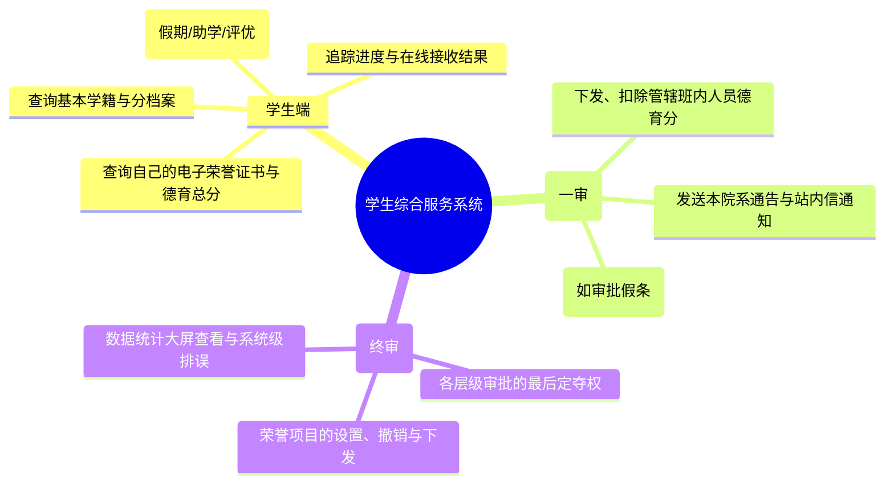
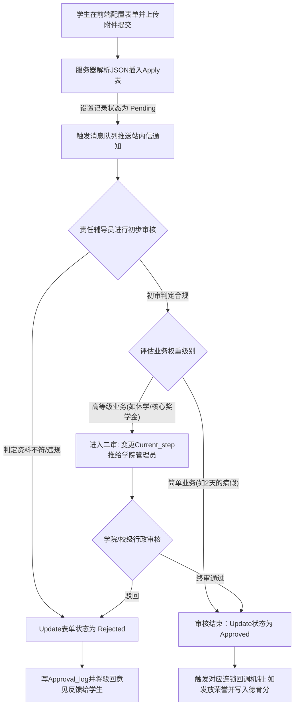
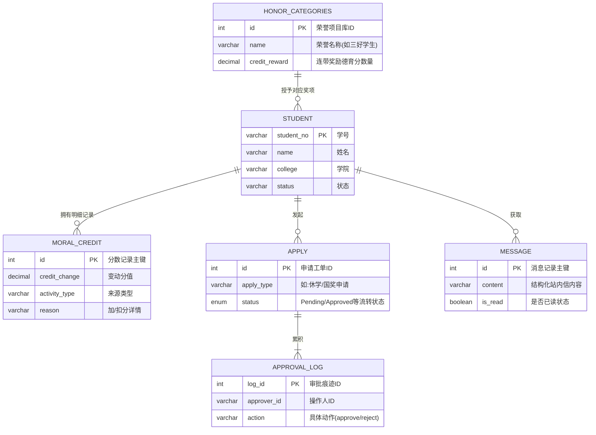

# 一站式学生综合服务系统 (SUDT) 项目文档与结构集

## 1. 项目概览
本项目“一站式学生综合服务系统”专注于提升高校学生事务管理的效率和数字化水平，为学生和教务人员提供集成的服务环境。系统涵盖了从学生基础信息管理、家庭及履历追踪、到德育分考核、各类荣誉及奖学金申请、请假/休学审批、全站消息通知等各个重要业务环节。

### 技术栈
- **前端 (Client)**: Vue 3 + Vite, 响应式用户界面
- **后端 (Server)**: Node.js + Express, 负责构建 RESTful API
- **数据库 (Database)**: MySQL (5.7+ / 8.0+) 持久化存储层

---

## 2. 项目目录结构说明
```text
Sudt/ 
├── client/                     # Vue 3 前端工程代码
│   ├── src/                    
│   │   ├── main.js             # Vue 应用实例挂载与全局插件注册入口
│   │   ├── App.vue             # 前端根页面骨架组件
│   │   ├── router/
│   │   │   └── index.js        # 路由配置中心 (定义页面 URL 与组件映射)
│   │   ├── utils/              
│   │   │   ├── api.js          # Axios 实例封装 (含拦截器、Token注入、全局错误捕捉)
│   │   │   ├── dialog.js       # 自定义对话框与弹窗的二次封装辅助函数
│   │   │   └── toast.js        # 全局轻量级 Toast 提示信息展示工具
│   │   ├── components/         # 页面中复用度较高的业务组件模块
│   │   │   ├── ConfirmDialog.vue # 统一的通用操作确认提示组件
│   │   │   ├── HonorAdmin.vue    # 行政人员端专用的“荣誉后台管理”组件面板
│   │   │   ├── HonorCenter.vue   # 供学生端使用的“荣誉大厅及申请”集成组件
│   │   │   ├── ProfileView.vue   # “个人中心与档案查阅”展示组件
│   │   │   └── Toast.vue         # 定制化悬浮消息提示 UI 组件
│   │   └── views/              # 顶级路由页面
│   │       ├── Dashboard.vue   # 核心系统大盘 (聚合多视图、侧边栏及功能菜单的主布局控制)
│   │       └── Login.vue       # 系统授权交互入口与账号密码登入认证页
│   ├── public/                 # 静态公共资源，不经过打包工具处理直接提供服务
│   ├── index.html              # 单页面应用(SPA)挂载入口
│   ├── vite.config.js          # Vite 配置，包括跨域代理(proxy)设置等
│   └── package.json            # 前端依赖配置与打包脚本清单 ( Vite, Vue 相关库树版本控制)
├── server/                     # Node.js Express 后端应用及接口服务
│   ├── index.js                # 端点服务主入口文件，集成鉴权拦截、JSON解析及全局路由分发
│   ├── db.js                   # MySQL 连接池核心配置文件，提供 promise 风格的高效查询句柄
│   ├── routes/                 # Resetful API 接口的控制路由分层 (核心业务逻辑处理器)
│   │   ├── admin_users.js      # 处理管理员对人员台账及学生基础信息的 CURD 接口
│   │   ├── apply.js            # 各类事务“工作流请假/申请”上报及流转状态机驱动接口
│   │   ├── honor.js            # “学术荣誉与评定模块”的读取、批量批准及撤回执行端点
│   │   ├── message.js          # 全局化站内信及私信操作逻辑 (含“未读”气泡标识更新)
│   │   ├── moral_credit.js     # “德育分资产库”的核心读写接口 (含历史流水和对冲逻辑计算)
│   │   └── notice.js           # 系统级广播通知、重要公文的下发推送器
│   ├── uploads/                # 动态存放用户材料证明(如 .pdf)及大尺寸头像等物理媒体文件池
│   ├── test_*.js 系列脚本        # 对于细化业务系统高并发与模块逻辑可行性测试的自动化脚本组
│   ├── init_*.js 系列脚本        # 结构初始化脚本：从0执行创建 MySQL 空表结构的重装核心类文件
│   ├── migrate_*.js 系列脚本     # 数据迁移与重构脚本：例如对后期架构新增表字段(Hash)的无缝修补
│   ├── package.json            # 后端环境构建包单据与 Express, Mutler, Jsonwebtoken 等环境依赖声明
│   └── package-lock.json       # Node 服务端模块的具体版本号哈希锁定管理缓存文件
├── docs/                       # 项目相关的辅助开发文件与备份文档
│   ├── sudt_db_backup.sql      # 一站式系统最核心的带演示数据与完整结构的备份数据库文件
│   └── migrate_to_cloud.bat/sh # 帮助一键将底层数据库跨平台自动直推上云端的部署 Shell 脚本
├── 项目说明文件.md              # 面向开发视角的全局软著及项目运行总览
├── 毕业论文结构模板.docx        # 学院官方下发的格式指导模板要求
└── 一站式学生综合服务系统需求规格说明书.pdf  # 原始项目开发需求指南
```

---

## 3. 核心数据库逻辑结构 (字段总结表)
详尽说明数据库中对于支撑“一站式”事务流转最关键的四张表。

### 3.1 用户与学生基础信息表 (`student`)
维护所有角色与学生基本台账信息。
| 字段名称 | 数据类型 | 约束条件 | 业务说明 |
| :--- | :--- | :--- | :--- |
| **id** | VARCHAR(50) | PRIMARY KEY (主键) | 用户的全局唯一ID（如student_001、admin_001） |
| student_no | VARCHAR(50) | UNIQUE | 学生的学籍号，系统登录账号依据 |
| name | VARCHAR(100) | NOT NULL | 用户真实姓名 |
| id_card | VARCHAR(18) | NOT NULL | 身份证号码 (实名认证必须) |
| college | VARCHAR(100) | 允许为空 | 所在二级学院架构 |
| major | VARCHAR(100) | 允许为空 | 所在专业 |
| status | ENUM | 默认'正常' | 用户状态或学籍状态 ('正常','休学','退学'等) |
| family_members | JSON | 允许为空 | 家庭成员关系网络 (JSON格式存储以便扩展) |

### 3.2 通用业务申请及审批工单表 (`apply`)
所有涉及“需经他人批准”的工作（请假、休学、奖学金申请）统一在此表进行流转。
| 字段名称 | 数据类型 | 约束条件 | 业务说明 |
| :--- | :--- | :--- | :--- |
| **id** | INT | PRIMARY KEY, AUTO_INCREMENT | 申请单的自增主键 |
| apply_type | VARCHAR(100) | NOT NULL | 申请业务类别 ('请假','助学金','休学'等) |
| applicant_id | VARCHAR(50) | FOREIGN KEY (student.id)| 发起申请的用户ID |
| content | TEXT | NOT NULL | 申请的核心理由与文本内容 |
| form_data | JSON | 允许为空 | 用于存储灵活复杂的自定表单数据 |
| status | ENUM | 默认'pending' | 工单状态 ('pending'待办, 'approved'通过, 'rejected'驳回) |
| current_step | INT | 默认 1 | 当前工作流进入到了第几级审批节点 |

### 3.3 德育分账单明细表 (`moral_credit`)
追踪学生校园行为与积分的历史总账与明细（如加分、扣分及理由）。
| 字段名称 | 数据类型 | 约束条件 | 业务说明 |
| :--- | :--- | :--- | :--- |
| **id** | INT | PRIMARY KEY, AUTO_INCREMENT | 条目自动编号 |
| student_id | VARCHAR(50) | FOREIGN KEY (student.id)| 所属学生ID |
| credit_change | DECIMAL(5,2)| NOT NULL | 本次发生的分数变动值 (可为正数或负数) |
| reason | VARCHAR(255) | NOT NULL | 加分或扣分的文字依据 |
| activity_type| VARCHAR(50) | 默认'manual' | 积分变动的原因分类 (志愿/活动/处分/荣誉自动转换) |
| operated_by | VARCHAR(50) | 允许为空 | 执行本次增减分数的审核人ID |
| status | ENUM | 默认'pending' | 成绩变动的生效状态 (针对学生自行申报预留) |

### 3.4 荣誉成就体系预设表 (`honor_categories`)
系统级别统一定义的可申请奖项，是各项评定指标的基准字典。
| 字段名称 | 数据类型 | 约束条件 | 业务说明 |
| :--- | :--- | :--- | :--- |
| **id** | BIGINT | PRIMARY KEY, AUTO_INCREMENT | 配置项的唯一序列号 |
| name | VARCHAR(100) | NOT NULL | 具体奖项的官方定名 (如'国家奖学金') |
| level | VARCHAR(50) | NOT NULL | 荣誉层级 ('国家级', '省部级', '校级') |
| credit_reward| DECIMAL(5,2)| 默认 0.00 | 若学生审批获得该荣誉，系统自动赠送的附加德育分 |
| status | TINYINT | 默认 1 (有效) | 该项荣誉是否在当前学年开放申请通道 |
| icon | VARCHAR(50) | 允许为空 | 前端荣誉大厅展示所需图标 |

---

## 4. 系统建模 UML 图纸源代码

### 4.1 用例图 (Use Case) - 核心角色功能概览
您可以在支持 Mermaid 的 Markdown 阅读器或通过在线工具转换出矢量图：



### 4.2 活动与流程图 (Flow Chart) - 单据流转核心逻辑
以最核心的“多级业务审批”为例：



### 4.3 数据库实体关系逻辑图 (ER Diagram)
展示数据库底层的核心外键引用逻辑：



---

## 5. 专属论文 AI 扩写辅助提示词大全
针对本目录和毕业论文的标准格式，您可以直接复制以下 Prompt（提示词），在文心一言、Kimi 或 GPT 中快速生成章节正文。

### 第一章 绪论
> **提示词**：“你现在是计算机科学与技术专业的本科毕业生。我正在写论文《一站式学生综合服务系统的设计与实现》，请帮我撰写【1.1 课题目的和意义】以及【1.2 文献综述/研究现状】。
> 要求：
> 1. 字数各800字左右，语言要学术、严谨、客观。
> 2. 【文献综述】中需指出当前大部分高校依然存在“信息化数据孤岛”、“不同部门办事依靠反复纸质签批效率低下”、“学生德育与荣誉考核标准不透明、流程断裂”的痛点。
> 3. 【目的和意义】中需简述该系统如何通过整合学生档案、串联多级审核流、并打通‘行为评价-事务办理-荣誉颁发’的统一线上数字化服务，来解决上述痛点。”

### 第二章 系统分析
> **提示词**：“正在撰写本毕业设计论文的【第2章 系统分析】。请以开发者的身份，帮我写以下内容：
> 1. 【2.1 可行性分析】(约800字)：请分别从‘技术可行性’（运用Vue3前端与Node.js后端技术的成熟度分析）、‘经济可行性’（均使用开源组件和软件，无过高授权费）、‘操作可行性’（界面具备现代响应式，学生交互体验好无学习成本）三个维度各写一段。
> 2. 【2.2.1 用户需求分析】(约500字)：以当前系统使用群体的视角展开，写出在日常大学生活中，学生需要一个移动化、进度可视化的请假和评优申请平台，避免线下来回跑办公室盖章。”

### 第三章 总体设计架构
> **提示词**：“请针对我论文的【3.1 系统功能模块设计】部分，撰写约1000字的论述文字。要求将系统功能划分为三个主要模块来论述设计思路：
> (1) 学生台账与统一权限控制模块：结合RBAC角色思想设计不同管理员和学生视图。
> (2) 消息中心与多级灵活工作流引擎模块（用于各类申请工单的流转、状态监听）。
> (3) 德育综合积分与荣誉成就系统联动模块（评定荣誉后触发加分回调）。
> 要求文字描述必须体现出‘高内聚低耦合、模块化设计’的设计模式，并采用面向对象开发的口吻。”

### 第四章 详细设计 (最核心章节)
> **提示词**：“帮我撰写论文的核心部分【4.1 核心流程：德育分与荣誉联动模块设计与实现】一节。必须包含以下文字描述，共约800字左右，分段清晰：
> 1. **模块设计阐述**：描述全套的系统化交互流程：学生从获得奖励后、在前端页面选定类目（如省部级奖项）、上传各类证明附件佐证资料。
> 2. **后端流转逻辑**：辅导员通过系统进入审批流，查验附件，批准该申请。
> 3. **系统事务逻辑**：批准后，系统触发事务（Transaction机制），不仅给该生增加`student_honors`履历项，而且根据预置的`credit_reward`字段，往`moral_credit`表中写入积分增量明细对冲账单，最终调用内部Message模块进行站内信广播通知结果。
> 注：尽量多使用API调用、关系型业务更新、组件通信等开发术语。”

### 第五章 系统测试
> **提示词**：“撰写【5.2 系统可用性测试与用例】章节。请为本系统的‘多层级流程审批功能’（如学生请休学/荣誉评定审批流）设计四个典型的‘黑盒功能测试用例’表。
> 请用 Markdown 表格直接生成，每个表格应包含：‘测试编号’、‘测试场景/要素’、‘前置条件（账号设置等）’、‘操作步骤流程’、‘预期结果’、‘实际执行结果（默认写全部通过）’。这表现了我的毕业设计确实经过了严密的系统质量控制。表格排版要美观专业。”
